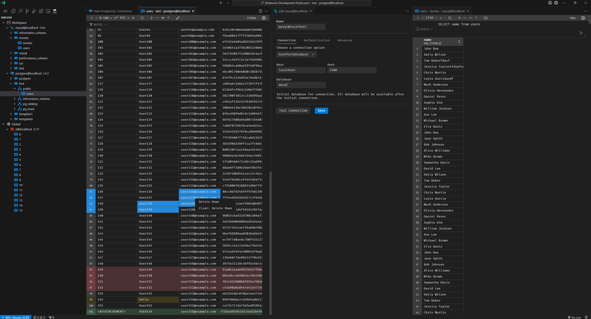

# SmileDB
A tool to interact with multiple database systems inside VSCode (:

> **_NOTE:_** This extension is in an experimental phase, and its future development is uncertain.

### Documentation
- [changelog](./CHANGELOG.md)
- [usage](./docs/usage.md)
- [development](./docs/development.md)

### Supported database systems
- PostgreSQL
- MySQL
- MongoDB
- MariaDB
- Redis

### Preview

